## Part 3 – Analyzing Social Media with Sales – Data Blending and Wrangling

>You must have completed Lab 200, in order to complete all sections of this Lab.

Key takeaways from this lab:
- Learning to Wrangle Data Sets
- Joining Multiple Data Sets for analysis.

## **Scenario**

As KoolKarts’ CMO, you have been evaluating revenue data to see if your team’s social media campaigns over the past 6 months have had a positive impact.

So far, you have found that **Clothing & Shoes** and **Electronics & Computers** product categories are the main contributors to sales in the past 6 months. However, they are not following the overall positive sales trends despite your social media campaign efforts.

This is concerning. You want to look at what is going on in the social media campaigns to understand the reason behind this.

Let’s look at the past 6 months of Oracle Data as a Service (DaaS) feeds on a KoolKart topic mentioning its product categories. These feeds come from numerous public social media sources including Facebook, Twitter, and others.

## Adding Additional Data Sources to a Project

1. Add another data source to your project.

    Download the <a href="https://github.com/oracle/learning-library/raw/master/workshops/dvcs-5/Exercise%20Files/DaaS%20Social%20Feeds-KoolKart.xlsx">**DaaS Social Feeds-KoolKart.xlsx**</a> file.

    There are two ways to add another data source:
    i) You can click on the **+** icon to open up the options and select **Add Data Set...** or
    ii) You can right click in any blank area in the **Project Components Menu** and select **Add Data Set**.

    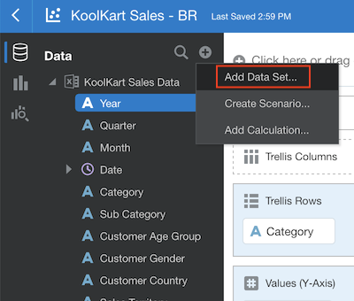

    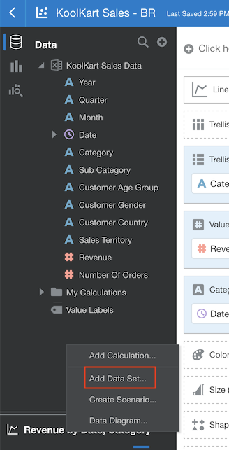

    Select **Create Data Source**.

    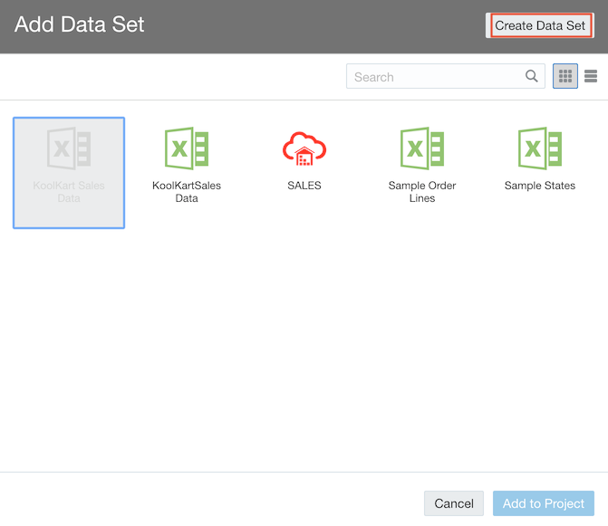

    >Whenever you upload a file, OAC DV treats it as a data set. Whenever you add a new data source to an existing DV project or are creating a new DV project, the system displays all the data sets you have previously uploaded. This is a nice feature that allows you to re-use data sets you previously uploaded for other DV projects. For this lab, we need to upload a new spreadsheet.

    Select **Drop data file here or click to browse**.

    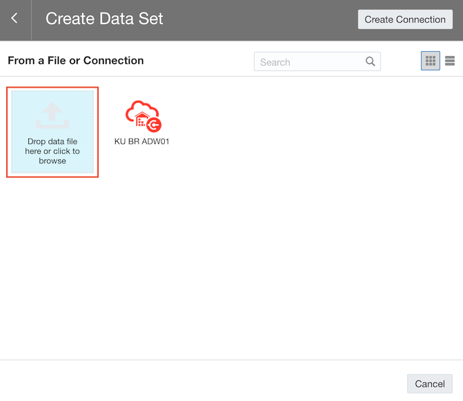

    In the file browser that pops up, find and select the **DaaS Social Feeds-KoolKart.xlsx** file.

    >This file contains Indicator words from posts to your social media pages or posts mentioning your business. It includes the total number of times the Indicator word was mentioned and whether it was mentioned in a positive tone, neutral tone, or negative tone. It is broken down by Date and Category. We are going to look at this data in conjunction with the already loaded revenue data to see if we can identify how social media might be impacting sales.

    The system uploads the file.

    >Notice that the system was intelligent enough to see that the Date column is common between the first data set (i.e. revenue spreadsheet) you uploaded into your current project and this one. Therefore, the system sets this column to Match. This, in turn, will enable you to create visualizations combining attributes and measures from both data sets at the same time.

    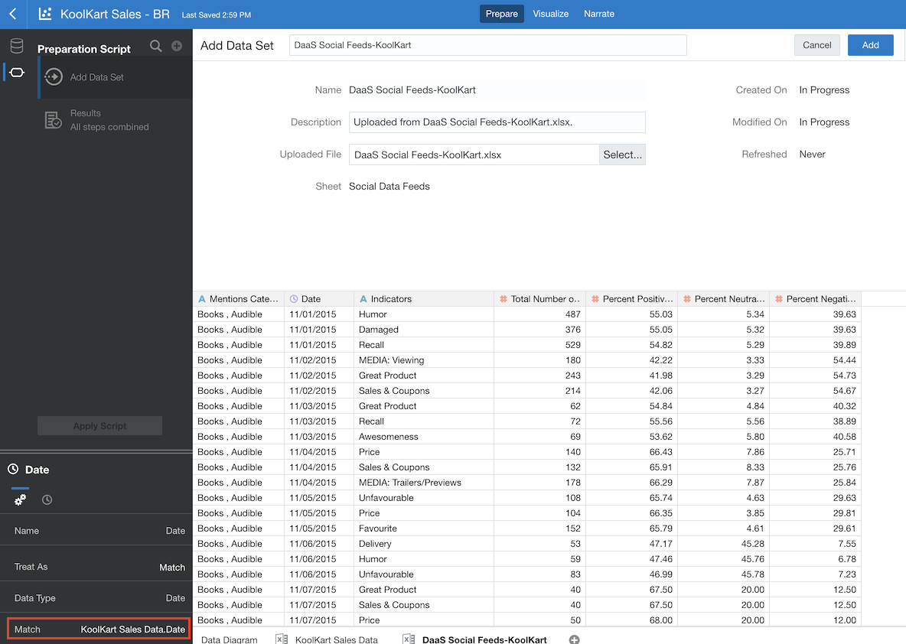

    >You do not need to change anything with this step. This is just to allow you to recognize that the system will auto match data sets where possible.

    

## Updating Aggregation Logic within a Data Source

1. Modify how DV will aggregate some of the fields by default.

    >DV will try to identify the best aggregation method (e.g. Average, Sum, Count) for Measures within a data set. However, if you want to use an alternate aggregation method, the system allows you to set the logic for every column. For this lab, we want to look at averages as opposed to sums when evaluating what percentage of social media comments are of a certain tone.

    Click on **Percent Positive Tone** field header. Now, in the **Data Panel** in the **Project Components Menu**, select **Sum** (next to **Aggregation**) and then select **Average**.

    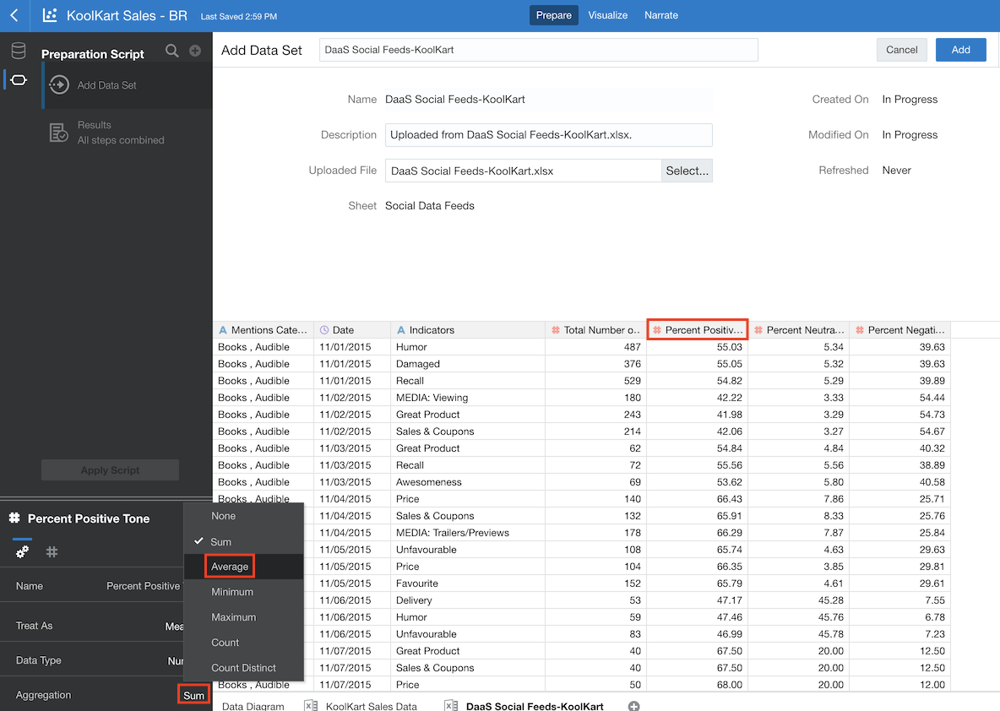

    

    Repeat the steps above for **Percent Neutral Tone** and **Percent Negative Tone**.

    

    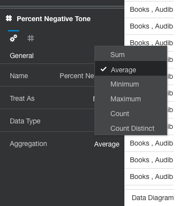

2. Update an **Attribute** to a **Measure**.

    >Upon importing data, DV will automatically identify numeric columns as measures. If the **Total Number of Snippets** column is not a measure, continue with the steps below. Else, skip to section c.

      There are two methods to do this:

      i) Select the **A** icon on the **Total Number of Snippets** header and select **Measure**.

      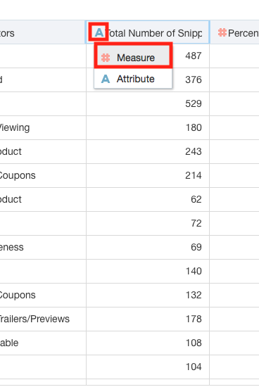

      or ii) Go to the **Data Panel**, select **Treat As** and change it to **Measure**.

      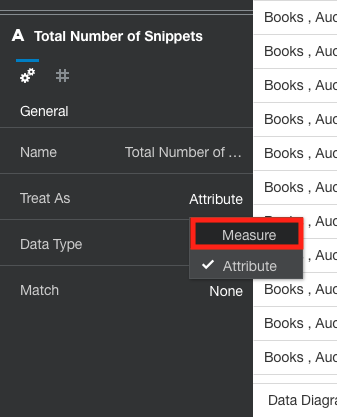

      Select **Add** to begin working with the data.

    

    You should now see the **DaaS Social Feeds-KoolKart** data set loaded into your project.

    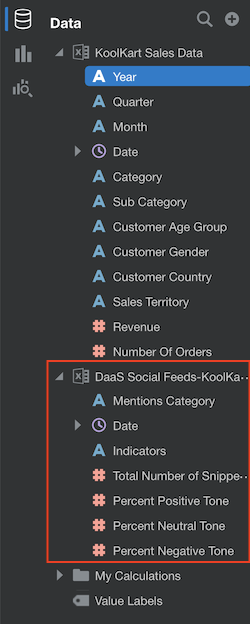

## Adding a Canvas to a Project with a New Visualization

> As previously covered, a DV Project can include multiple Canvases for organizing visualizations.

1. Add a new **Canvas**.

    Select the **Visualize** tab at the top right of the screen.

    

    Select the **+** icon at the bottom left of the screen to add a new **Canvas**.

    

2. Add a new visualization to the new Canvas.

    Select **Mentions Category** under the **DaaS Social Feeds – KoolKart** data source (within the **Data Elements** option of the **Project Components Menu** on the left).

    Hold down the **Control(Windows)** or **Command(Mac)** key and select **Total Number of Snippets**. Right click and select **Create Best Visualization**.

    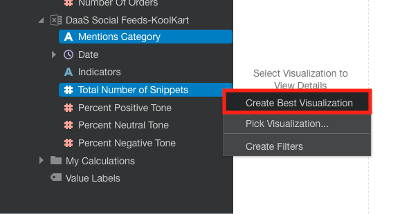

    The system will have determined that a **Horizontal Bar Chart** is the best option for displaying this data.

    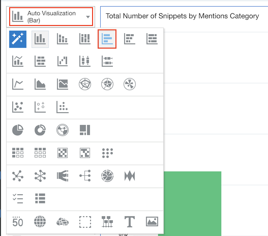

    >We seem to have enough volume of activities (i.e. snippets) for each category so that’s good. However, the format of the Mentions Category data seems to be different from the format of the Category data in our KoolKart Sales Data (e.g. Clothing, Shoes vs. Clothing & Shoes). So, it looks like we need to figure out a way to “adjust” the data.

## Wrangling Sales Data to Align it with Social Media Data

1. Modify the data in the social media data source to allow it to be merged with the sales data.

    >Data wrangling enables you to manipulate the data in an existing “raw” data set for easier consumption by tools like analytics and reporting platforms. This eliminates having to go back and make changes to your source tables/files (in our case, the Excel file) and then re-uploading again.

    Select the **Prepare** tab.

    

    Select the **KoolKart Sales Data** tab in the bottom left of the **Canvas**.

    

    >As previously stated, the way **Category** is displayed here (i.e. with Ampersand aka '&') is different from how it is displayed in the **DaaS Social Feeds-KooKart** data set.

    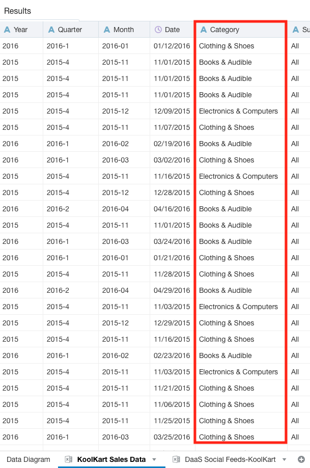

    

    Make sure you are on the **KoolKart Sales Data** tab in the bottom left and select the **Ellipses** icon  next to the **Category** column.

    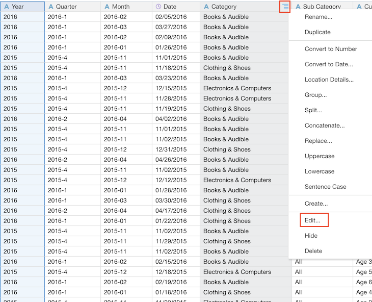

    Select **Edit**.

    

    You should see an expression editor, which we will use to replace the ampersands in **Category** with commas.

    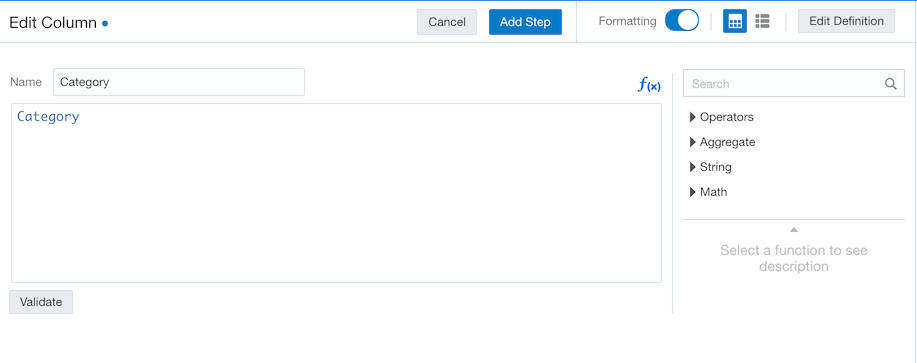

    >We will walk you through the exact expression for this lab. Please notice the editor supports a wide range of functionality for structuring data to suit your analytical needs.

    Delete the existing content in the **Expression Box** (e.g. **Category**). Expand the values under **String** in the **Function Menu**.

    

    Scroll down and select (e.g. double click) **Replace**.

    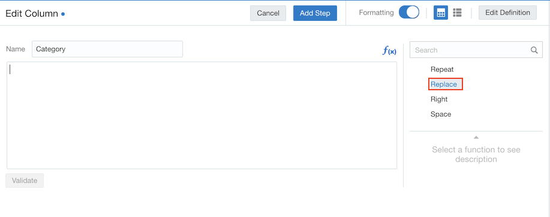 

    You can also search **Replace** in the search bar.

    The system will show you the required format of the function. Click on the first occurrence of **expression** and type in "Categ". You will see the system provides suggestions. Click on **Category**.

    

    Click the next occurrence of **expression** and type in ‘&’ (include the single quotes).
    Click the next occurrence of **expression** and type in ‘,’ (include the single quotes).

    The expression should now appear as: **REPLACE(Category, '&', ',')**. The function should be validated, automatically. If not, click the **Validate** button.  

    

    Click **Add Step** to apply your changes, once validated. If you face any issues then please try again.

    The **Category** field should now appear with commas. Click on **Apply Script** in the **Project Components Menu** under **Preparation Script**.

    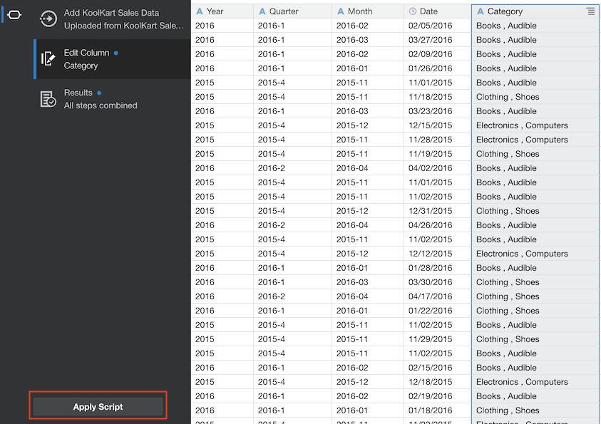

## Using Data Source Diagrams and Creating Additional Join Logic

> In the last exercise, we modified some of the data in the **KoolKart Sales Data** data set to ensure that it aligned with the **DaaS Social Feeds-KoolKart** data set. Now that **Category** / **Mentions Category** appears in a similar way in both data sets, we can tell the system to join the two data sets.

1. Create an additional join (e.g. matching logic) between the sales and social feeds data sets.

    Select **Data Diagram** in the bottom left.

    

   >**Data Diagram** displays a visualization of the data sets being utilized within the project. Currently, we are using two Excel files, so you will see those represented. You can also see the joins between the two data sets. The system automatically matched the files according to date. Now that we have made some changes to the data, we can also join the data sets on **Category** and **Mentions Category**.

   

   Click on the number **1** in the diagram. In the pop-up menu, click on **Add Another Match**.

   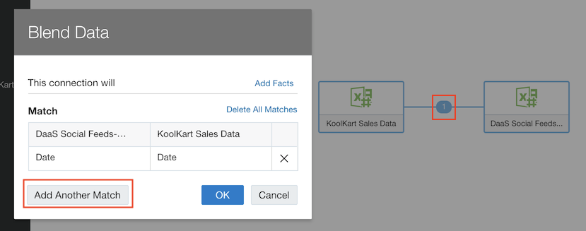

   You can now identify the logic to join the data sets. In the first column of the new row, use the dropdown to select **Mentions Category**. In the second column, select **Category**.

   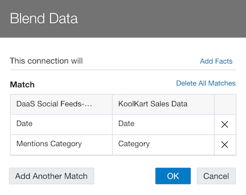

   >You may have noticed that only Attributes are displayed. This is by design as Measures are for aggregation- not dimensional analysis or joins. If need be, you can always modify a column or create a copy of it in another format (e.g. a data set could have a column defined as an Attribute and a copy of that column defined as a Measure with count aggregation).

   Click **OK**.

   The data source diagram will now show there are **2** joins between the data sets.

   

[Continue to Part 4](/Oracle-Analytics-Cloud-Workshop/?lab=part-4-visualize-narrate)