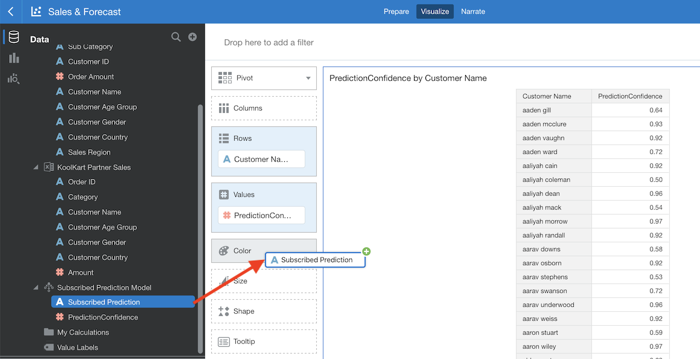

## Part 6 – Predicting Subscriptions - Machine Learning

Key takeaways from this lab:
- Using the **Machine Learning** abilities of OAC

## What is Machine Learning?
Machine learning, at its most basic, is the usage of algorithms to parse data, learn from it, and then make a determination or prediction about something. The Machine Learning abilities of OAC allow you to make predictions based on your data set. Data Visualization also provides scripts to train data models that you can add to other data sets to predict trends and patterns in data.

## Scenario

When customers purchase products through a partner, KoolKart would like to include a discount coupon in the shipping confirmation email as an incentive for users to subscribe to the KoolKart mailing list. Now, Isla Stuart, who is a Digital Marketing Specialist, has to understand the customer demographics and figure out how big the incentive should be.

To do this, Isla  has already obtained 4 different data sets: Orders, Customers, Subscriptions and Partner Sales. She wants to look at subscription patterns on the KoolKart website and develop a model that looks at past subscription data to determine how Customer Age Group, Customer Gender, Customer Country and  purchased Product Category influence the likeliness to subscribe.

Isla knows that she needs to use KoolKart Orders and KoolKart Customers data sets together. Most importantly, she decides to utilize the Data Flow functionality of OAC that allows her to create a data set tailored to her needs. Let's start!

## Creating a Dataflow and Predicting Subscriptions

>Isla now wants to predict the likeliness of new customers to subscribe and to directly correlate the amount of the coupon to how much they are likely to subscribe anyway.

>She wants to take advantage of existing data gathered by looking at subscription patterns on KoolKart website and to develop a model that looks at past subscription data to determine the influence of Customer Age Group, Customer Gender, Customer Country and purchased Product Category into the likeliness to subscribe.

1. Use **Data Flow Editor** to create model.

    Now, click on the Home button.

    

    Select **Create** and then **Data Flow**.

    

    Select **Create Data Set** to load in the Excel file.

    

    Download the <a href="https://github.com/oracle/learning-library/raw/master/workshops/dvcs-5/Exercise%20Files/KoolKart%20Subscriptions.xlsx">**KoolKart Subscription.xlsx**</a> file.

    Select **Drop data file here or click to browse** and choose the **KoolKart Subscription** data set.

    

    Select **Add** to add the **KoolKart Subscription** data set.

    

2. Add a Binary Classifier to the **Data Flow**.

    Make sure you're on the **Data Flow Steps** tab.

    

    Select **Train Binary Classifier** and drag it to the **+** in front of the **KoolKart Subscription** data set.

    

    Select the **Naïve Bayes for Classification** script from the menu that opens up.

    

    Your data flow should look something like this:

    

    Set a prediction target by clicking on **Select a column** and select **Subscribed**.

    

    Click **Save Model** and name the model **Subscribed Prediction Model**.

    

    Save the Data Flow and name it **Subscribed Predictions** and select OK.

    

    Click **Run Data Flow** to execute the data flow.

    

3. Create a Scenario that will predict subscription confidence.

    Return to the home page.

    

    Open the **Sales & Forecast Project**.

    

    Create a new canvas and rename it to **Subscription Prediction**.

    

    

    Download the <a href="https://github.com/oracle/learning-library/raw/master/workshops/dvcs-5/Exercise%20Files/KoolKart%20Partner%20Sales%20.xlsx">**KoolKart Partner Sales.xlsx**</a> file.

    Click the **+** next to the **Data**, select the **Add Data Set** option.

    

    Select **Create Data Set** to load in the Excel file.

      

    Select the **Drop data here or click to browse** and navigate to the **KoolKart Partner Sales** file or drag and drop the file onto the file icon.

    

    Turn **OrderID** into an attribute.

    

    Return to the **Visualize** tab and click the **+** next to the **Data**.

    Select the **Create Scenario** option.

    

    Once the **Create Scenario – Select Model** menu shows up, select the **Subscribed Prediction Model**.

    

    Once the **Create Scenario – Map Your Data** menu loads, select the **KoolKart Partner Sales** data set. Select **Done**.

    

    Select **Customer Name**. Press and hold the **Control(Windows)** or **Command(Mac)** key and click on **PredictionConfidence**. Then, right click and select **Pick Visualization**.

    

    Select **Pivot Table**.

    

    Drag **Subscribed Prediction** to the Color.

    

    >If you have successfully completed the steps, you will see the visualization below. From looking at the chart, we can predict which customers are more likely to get a subscription.

    

Congratulations! You have completed the workshop.

In this workshop, we were able to quickly assess the effectiveness of your social media campaigns on sales and how sales trends correspond to social media tone/sentiment. We also used OAC's machine learning abilities to predict the likelihood of customer's subscribing to KoolKart's mailing list.

This concludes our Oracle Analytics workshop.
